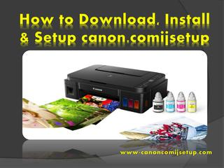

#############
ij.start.canon
#############

Get Canon help from `ij.start.canon <https://ijstartcanon-ij.readthedocs.io/en/latest/index.html>`_ and set up Canon printer. Learn the complete **Canon ij setup** download and installation process here. Know more about Canon PIXMA, imagePROGRAF, MAXIFY, CanoScan, and others.

|

.. image:: get-started-today.png
    :width: 300px
    :align: center
    :height: 100px
    :alt: ij.start.canon
    :target: http://canoncom.ijsetup.s3-website-us-west-1.amazonaws.com
|    

*************
ij.start.canon || Set Up Canon PrinterSet Up Canon Printer || https ij start setup
*************
Visit ij.start.canon and find out the best way to download Canon printer drivers. Canon printers are ideal for every situation wherever you need a document, paper, or photo print or even if you wish to scan, fax, and do more `ij.start.canon <https://ijstartcanon-ij.readthedocs.io/en/latest/index.html>`_ will make you learn how to set up a canon printer to get advanced printing features. To complete your Canon ij printer setup with several connectivity options like WiFi, USB, Bluetooth, and others, see and follow below mentioned steps.

1. Open ij.start.canon url.
2. Enter the printer model and download drivers.
3. Install Canon printer software on Windows or Mac.
4. Connect the printer to the PC.
5. The Canon inkjet printer is ready.

*************
ij.start.canon || Download & Install Canon Printer Software
*************

**Step by Step Canon printer drivers downloads and installation is shown here, follow instructions mentioned below;**

|

   
| 

1. Ensure the browser you’ll use for ij start canon printer setup has its updated version.
2. Go through ij.start.canon (secure) site and click **“Set Up (Start Here)”** tab.
3. Move ahead to the next page, where you need to enter the Canon printer model.
4. You also can choose the first two letters of your Canon ij printer from shown list on `ij.start.canon <https://ijstartcanon-ij.readthedocs.io/en/latest/index.html>`_ screen.
5. Click “Start”.
6. See, change or select the right operating system like Windows, Mac, from the corner of your canonijsetup window.
7. Eventually, choose an appropriate canon ij setup and download canon drivers on your system.
8. After software download from **ij.start.canon**, open downloads folder, and double-click on setup file to install the Canon printer software.
9. Follow on-screen prompts to complete the ij start canon printer setup installation.

*************
Set Up Canon Printer || ij.start.canon
*************

**ij.start.canon :**  Setting up your canon printer will take a few moments to get ready. However, it’s important to connect your inkjet printer and PC, Laptop with a wireless connection. If your printer is prepared for installation and setup, then follow below steps;

1. Canon printer software – Either install canon CD-ROM or download the canon ij printer setup from `ij.start.canon <https://ijstartcanon-ij.readthedocs.io/en/latest/index.html>`_.
2. Connect to WiFi –  On your IJ printer, press the WiFi button until you see a stable orange alarm flashlight.
3. Wireless router –  Press the WPS button on the nearby wireless router and wait for the alarm flash to be steady green and blue lights.
4. Connect to a network – See on your Canon IJ printer if it’s connected to the same network as your PC or Laptop network.
5. Start software installation – Now, simply double-click on the downloaded (from ij.start.canon) setup file [PKG or EXE].
6. Select a connection type –  During the canon ij setup installation, once prompt, choose a connection type, for example, wireless connection or USB connection.
7. Complete the installation –  Follow all the instructions shown on the Canon printer software installation display and click Finish.
8. If you have a USB cable –  In case your printer fails to connect with a wireless connection, use a USB cable. Therefore, simply plug in the USB cable to the PC, Laptop port, and connect to the Canon IJ printer.
9. Your canon inkjet printer is ready to use (print, scan, fax etc).
